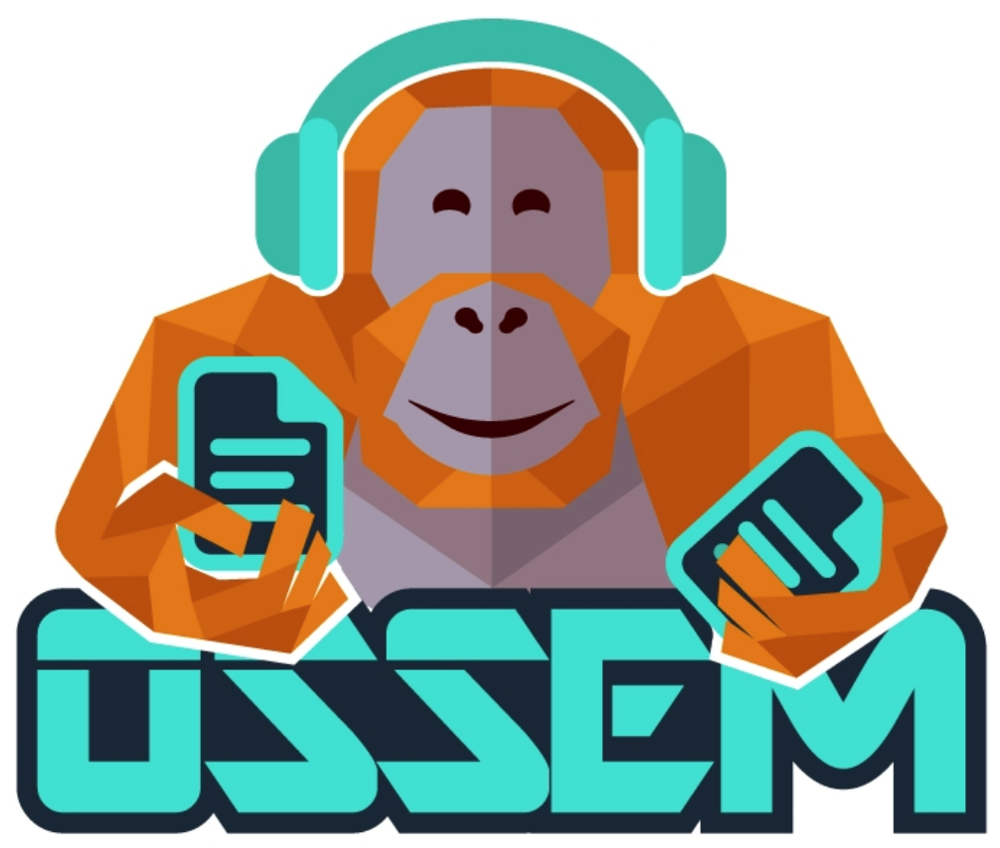

# Open Source Security Events Metadata (OSSEM)

A community-led project focused primarily on the documentation, standardization and modeling of security event logs.

## https://ossemproject.com/intro.html

# Goals

* Define and share a common data model in order to improve the data standardization and transformation of security event logs
* Define and share data structures and relationships identified in security events logs
* Provide detailed information in a dictionary format about several security event logs to the community
* Learn more about security event logs (Windows, Linux, MacOS, Azure, AWS, etc)

# Project Structure

* [Data Dictionaries (DD)](https://github.com/OTRF/OSSEM-DD):
  * Contains specific information about several security event logs organized by operating system and their respective data providers.
  * Each dictionary describes a single event log and its corresponding field names.
  * It provides the foundational concepts to create a data wiki in an organization.
* [Common Data Model (CDM)](https://github.com/OTRF/OSSEM-CDM)
  * Facilitates the normalization of data by providing a standard way to parse security event logs.
  * The project is organized by [schema entities](https://github.com/OTRF/OSSEM-CDM/tree/master/schemas/entities) identified in several data sources.
  * The definitions of each schema entity and its respective attributes (field names) are mostly general descriptions that could help and expedite event logs parsing procedures.
  * The project also provides the concept of [schema tables](https://github.com/OTRF/OSSEM-CDM/tree/master/schemas/tables) to aggregate common entities and parse similar data sources. For example, HTTP, Port and User Agent entities can be used to normalize network traffic metadata captured in a network environment.
* [Detection Model (DM)](https://github.com/OTRF/OSSEM-DM):
  * Focuses on identifying [relationships](https://github.com/OTRF/OSSEM-DM/tree/main/relationships) among security events to facilitate the development of data analytics and help validate the detection of adversary techniques.

# Sponsors

# Author

* Roberto Rodriguez [@Cyb3rWard0g](https://twitter.com/Cyb3rWard0g)

# Current Committers

* Jose Luis Rodriguez [@Cyb3rPandaH](https://twitter.com/Cyb3rPandaH)
* Nate Guagenti [@neu5ron](https://twitter.com/neu5ron)
* Ricardo Dias [@hxnoyd](https://twitter.com/hxnoyd)

# Projects Using OSSEM

* [HELK](https://github.com/Cyb3rWard0g/HELK)
* [Azure Sentinel Normalization](https://docs.microsoft.com/en-us/azure/sentinel/normalization-schema)

# Resources

* [Ready to hunt? First, Show me your data!](https://cyberwardog.blogspot.com/2017/12/ready-to-hunt-first-show-me-your-data.html)
* [What's new in Windows 10, versions 1507 and 1511](https://docs.microsoft.com/en-us/windows/whats-new/whats-new-windows-10-version-1507-and-1511#bkmk-lsass)
* [Download Security Audit Events for Windows (Spreadsheet)](https://www.microsoft.com/en-us/download/details.aspx?id=50034)
* [Advanced Security Audit Policy Settings](https://docs.microsoft.com/en-us/windows/security/threat-protection/auditing/advanced-security-audit-policy-settings)
* [Monitoring Active Directory for Signs of Compromise](https://docs.microsoft.com/en-us/windows-server/identity/ad-ds/plan/security-best-practices/monitoring-active-directory-for-signs-of-compromise#audit-account-management)
* [Audit Policy Recommendations](https://docs.microsoft.com/en-us/windows-server/identity/ad-ds/plan/security-best-practices/audit-policy-recommendations)
* [Use Windows Event Forwarding to help with intrusion detection](https://docs.microsoft.com/en-us/windows/security/threat-protection/use-windows-event-forwarding-to-assist-in-intrusion-detection)
* [Minimum recommended minimum audit policy](https://docs.microsoft.com/en-us/windows/security/threat-protection/use-windows-event-forwarding-to-assist-in-intrusion-detection#a-href-idbkmk-appendixaaappendix-a---minimum-recommended-minimum-audit-policy)
* [Windows ITPro Docs - Threat Protection](https://github.com/MicrosoftDocs/windows-itpro-docs/tree/master/windows/security/threat-protection)
* [MITRE ATT&CKcon 2018: Hunters ATT&CKing with the Data](https://youtu.be/QCDBjFJ_C3g)
* [MITRE ATT&CKcon 2.0: Ready to ATT&CK? Bring Your Own Data (BYOD) and Validate Your Data Analytics!](https://youtu.be/eM0c_Gil-38)
* [Defining ATT&CK Data Sources, Part I: Enhancing the Current State](https://medium.com/mitre-attack/defining-attack-data-sources-part-i-4c39e581454f)
* [Defining ATT&CK Data Sources, Part II: Operationalizing the Methodology](https://medium.com/mitre-attack/defining-attack-data-sources-part-ii-1fc98738ba5b)
