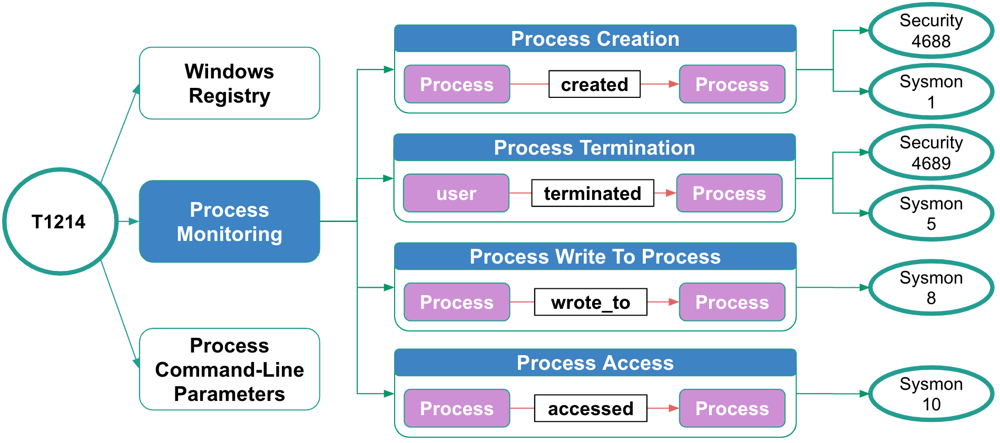

# MITRE ATT&CK

>MITRE’s Adversarial Tactics, Techniques and Common Knowledge (ATT&CK™) is a curated knowledge base and model for cyber adversary behavior, reflecting the various phases of an adversary’s lifecycle and the platforms they are known to target. ATT&CK is useful for understanding security risk against known adversary behavior, for planning security improvements, and verifying defenses work as expected. 

Reference: [ATTCK](https://attack.mitre.org/wiki/Main_Page)

This part of the OSSEM project focuses on the documentation of ATT&CK data sources suggested or associated with techniques defined in the [Enterprise Matrix](https://attack.mitre.org/wiki/Technique_Matrix). In addition, here is where ATT&CK data sources will be mapped with specific sub data sources defined in the [Detection Data Model](https://github.com/Cyb3rWard0g/OSSEM/blob/master/detection_data_model) with the main goal of creating a link between ATT&CK data sources and event logs.

Data source (Process Monitoring) mapped to specific event logs example:

## Mapping event logs to ATT&CK data sources

The methodology follows the next steps:

* Exploring ATT&CK data sources
* Documenting event logs related to ATT&CK data sources
* Develop a data model
* Map event logs to ATT&CK data sources

Resources:

* [Jupyter notebook to explore ATT&CK data sources](https://github.com/Cyb3rWard0g/ATTACK-Python-Client/blob/master/notebooks/ATT%26CK_DataSources%20(1).ipynb)
* [ATT&CKcon 2018: Slides and demos documents](https://github.com/Cyb3rWard0g/presentations/tree/master/ATTACKcon)
* [ATT&CK Data Sources mapped to Event Logs](https://docs.google.com/spreadsheets/d/1ow7YRDEDJs67kcKMZZ66_5z1ipJry9QrsDQkjQvizJM/edit?usp=sharing)
