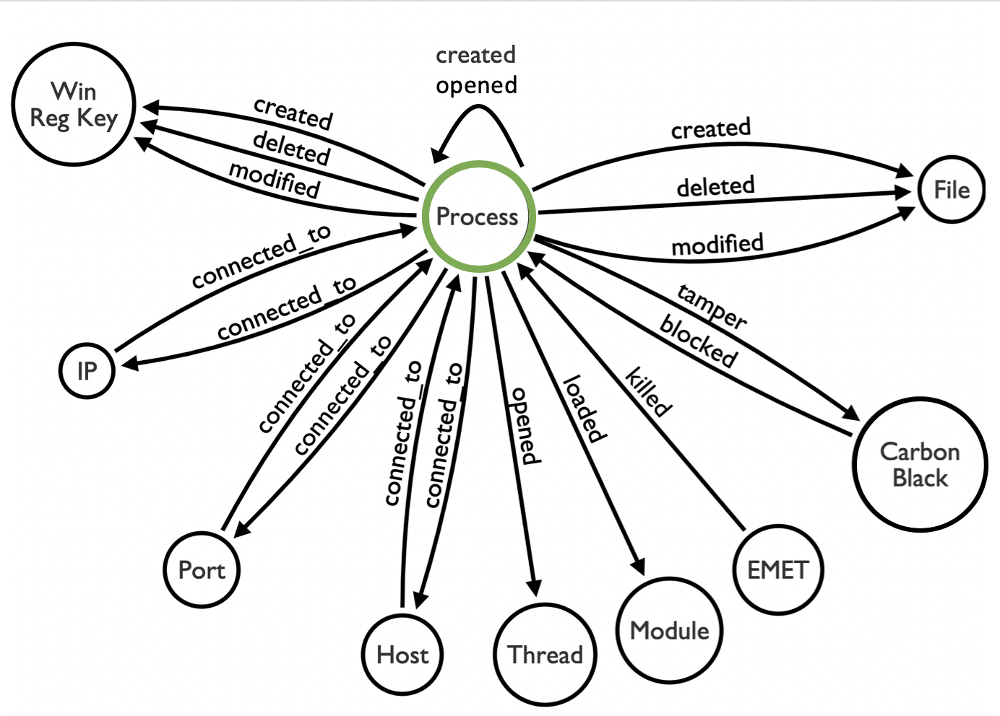

# Windows Carbon Black Event Logs

Carbon Black data schema as defined by the Carbon Black Developer Resources.

## Data Model

## Data Dictionaries

* [ingress.event.childproc](events/childproc.md)
* [ingress.event.crossprocopen](crossprocopen.md)
* [ingress.event.emetmitigation](events/emetmitigation.md)
* [ingress.event.filemod](events/filemod.md)
* [ingress.event.moduleload](moduleload.md)
* [ingress.event.netconn](events/netconn.md)
* [ingress.event.processblock](events/processblock.md)
* [ingress.event.procstart](procstart.md)
* [ingress.event.regmod](events/regmod.md)
* [ingress.event.tamper](events/tamper.md)

## Resources

* [Carboon Black Event Schema](https://developer.carbonblack.com/reference/enterprise-response/event-forwarder/event-schema/)