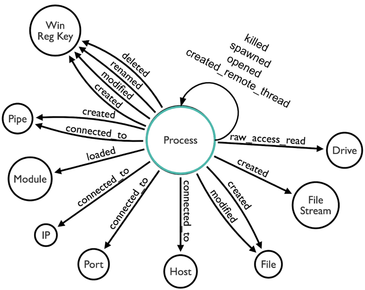

# Sysmon Event Logs

## Data Model

## Data Dictionaries

| EventID | Name | Description |
|--------|---------|---------|
| 1 | [Process creation](event-1.md) | Information about a newly created process |
| 2 | [A process changed a file creation time](event-2.md) | File creation time is explicitly modified by a process |
| 3 | [Network connection](event-3.md) | The network connection event logs TCP/UDP connections on the machine |
| 4 | [Sysmon service state changed](event-4.md) | Reports the state of the Sysmon service (started or stopped) |
| 5 | [Process terminated](event-5.md) | Reports when a process terminates |
| 6 | [Driver loaded](event-6.md) | Information about a driver being loaded on the system |
| 7 | [Image loaded](event-7.md) | Logs when a module is loaded in a specific process |
| 8 | [CreateRemoteThread](event-8.md) | Detects when a process creates a thread in another process |
| 9 | [RawAccessRead](event-9.md) | Detects when a process conducts reading operations from the drive using the \\.\ denotation |
| 10 | [ProcessAccess](event-10.md) | Reports when a process opens another process |
| 11 | [FileCreate](event-11.md) | File create operations are logged when a file is created or overwritten |
| 12 | [RegistryEvent (Object create and delete)](event-12.md) | Registry key and value create and delete operations map to this event type |
| 13 | [RegistryEvent (Value Set)](event-13.md) | This Registry event type identifies Registry value modifications |
| 14 | [RegistryEvent (Key and Value Rename)](event-14.md) | Registry key and value rename operations map to this event type |
| 15 | [FileCreateStreamHash](event-15.md) | This event logs when a named file stream is created |
| 16 | [Sysmon Config State Changed](event-16.md) | This event logs when the local sysmon configuration is updated |
| 17 | [PipeEvent - Pipe Created](event-17.md) | This event generates when a named pipe is created |
| 18 | [PipeEvent - Pipe Connected](event-18.md) | This event logs when a named pipe connection is made between a client and a server |
| 19 | [WmiEvent - WmiEventFilter activity detected](event-19.md) | This event logs when a WMI event filter is registered |
| 20 | [WmiEvent - WmiEventConsumer activity detected](event-20.md) | This event logs the registration of WMI consumers, recording the consumer name, log, and destination |
| 21 | [WmiEvent - WmiEventConsumerToFilter activity detected](event-21.md) | This event logs when a consumer binds to a filter, this event logs the consumer name and filter path. |

## Data Sample

[sysmon9.0.1.tar.gz](./sysmon9_0_1.tar.gz)

## Data Schema

[Sysmon Manifest Schema 4.2](./sysmon_manifest_4.2.xml)